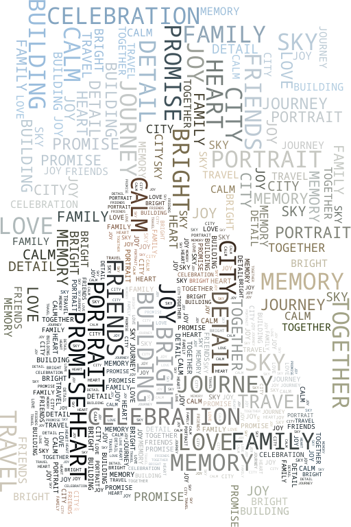

# image-play

`image-play` is a Go image effects CLI for typography-driven image generation.

The CLI currently supports:

- `textmosaic`: recreates an image from repeated text characters colored from the source image.
- `wordcloud`: packs rendered words into image-derived regions using glyph-level collision, mask containment, and deterministic placement.

## Example Output

### Text Mosaic

<table>
  <tr>
    <th>Input Image</th>
    <th>Generated Text Mosaic</th>
  </tr>
  <tr>
    <td></td>
    <td></td>
  </tr>
</table>

Generated with:

```bash
./bin/mosaic \
  -effect textmosaic \
  -in docs/assets/input_img.jpg \
  -text-file testdata/text/sample_text_message.txt \
  -out docs/assets/generated_text_mosaic.png \
  -width 1080
```

### Word Cloud: Foreground/Background Photo

For full photos, the CLI automatically derives a foreground mask with OpenCV GrabCut. The foreground is packed more densely and the background uses larger, lighter words.

<table>
  <tr>
    <th>Input Image</th>
    <th>Generated Word Cloud</th>
  </tr>
  <tr>
    <td></td>
    <td></td>
  </tr>
</table>

Generated with:

```bash
./bin/mosaic \
  -effect wordcloud \
  -in docs/assets/input_img.jpg \
  -text-file testdata/text/sample_word_cloud_words.txt \
  -out docs/assets/generated_word_cloud_photo.png
```

### Word Cloud: Dense Foreground Subject

For bright-background subject images, the CLI automatically switches to a foreground-only tonal mask.

<table>
  <tr>
    <th>Input Image</th>
    <th>Generated Word Cloud</th>
  </tr>
  <tr>
    <td></td>
    <td></td>
  </tr>
</table>

Generated with:

```bash
./bin/mosaic \
  -effect wordcloud \
  -in docs/assets/input_word_cloud_couple.png \
  -text-file testdata/text/sample_word_cloud_words.txt \
  -out docs/assets/generated_word_cloud_couple.png
```

## Requirements

- Go 1.21+
- OpenCV 4 and `pkg-config` for foreground segmentation through GoCV
- An input image such as `.jpg` or `.png`

On macOS with Homebrew:

```bash
brew install opencv pkg-config
pkg-config --modversion opencv4
```

The repo includes a default font, so `-font` is optional when commands are run from the repo root:

```txt
fonts/NotoSansMono-VariableFont_wdth,wght.ttf
```

## Build

```bash
go build -o ./bin/mosaic ./cmd/mosaic
```

Show help:

```bash
./bin/mosaic -h
```

## CLI Usage

The simplest commands only need an effect, input, and output. If `-text` and `-text-file` are omitted, the CLI uses built-in sample text.

```bash
./bin/mosaic -effect textmosaic -in docs/assets/input_img.jpg -out text-mosaic.png
./bin/mosaic -effect wordcloud -in docs/assets/input_img.jpg -out photo-wordcloud.png
./bin/mosaic -effect wordcloud -in docs/assets/input_word_cloud_couple.png -out subject-wordcloud.png
```

Use custom text from a file:

```bash
./bin/mosaic \
  -effect wordcloud \
  -in docs/assets/input_img.jpg \
  -text-file testdata/text/sample_word_cloud_words.txt \
  -out photo-wordcloud.png
```

Use inline text:

```bash
./bin/mosaic \
  -effect textmosaic \
  -in testdata/images/couple_tour.jpg \
  -text "Typography can rebuild an image through repeated color samples." \
  -out inline-text-mosaic.png \
  -width 1080
```

### Word Cloud Presets

The word cloud effect auto-selects a sensible mode when `-packing-profile` is omitted:

- Bright-background subject images use a dense foreground-only tonal profile.
- Full photos use a foreground/background profile with OpenCV foreground segmentation.
- Clean silhouette masks can be controlled explicitly with `-packing-profile binary-silhouette`.

The automatic presets favor readable words over maximum coverage. To make words larger and clearer, increase `-min-font-size`, reduce `-density`, reduce `-final-fill-passes`, or add `-word-padding 1`. To push toward poster-style dense packing, use `-quality dense` or `-quality poster` with a higher `-density`.

Example palette-driven silhouette:

```bash
./bin/mosaic \
  -effect wordcloud \
  -in silhouette.png \
  -text-file words.txt \
  -out silhouette-wordcloud.png \
  -width 1080 \
  -packing-profile binary-silhouette \
  -quality poster \
  -mask-type light \
  -mask-threshold 0.5 \
  -color-mode random-palette \
  -palette "#8c1d18,#e4572e,#f3a712,#f7f1d7" \
  -background "#000000" \
  -seed 42
```

## How Word Cloud Packing Works

The word cloud engine uses the mathematically correct collision model for dense word clouds:

```txt
rendered glyph alpha pixels intersect source mask intersect occupied glyph pixels
```

That means empty bounding-box space around letters is not treated as occupied. Candidate words are rendered into alpha masks, optionally rotated, checked against the target mask at glyph-pixel precision, checked against an occupancy map with optional padding, and then stamped into the result.

For photo inputs, the CLI can generate a foreground mask with OpenCV GrabCut. The word cloud engine then renders a larger-word background layer and a denser foreground layer so closer subjects carry more visual detail.

## Features

- Glyph-pixel word collision instead of rectangle-only packing
- Glyph-pixel mask containment
- Bounded Archimedean spiral placement
- Precomputed placement anchors
- Optional word padding
- Dense final fill pass for small contour details
- Foreground/background photo profile using OpenCV GrabCut
- Bright-background subject profile
- Binary silhouette and tonal detail profiles
- Source, palette, luminance-palette, random-palette, and sequential-palette color modes
- Deterministic seed control
- Placement stats in CLI output

## Project Structure

```txt
image-play/
├── cmd/mosaic/
│   ├── main.go
│   └── wordcloud_cli.go
├── docs/assets/
│   ├── generated_text_mosaic.png
│   ├── generated_word_cloud_couple.png
│   ├── generated_word_cloud_photo.png
│   ├── input_img.jpg
│   └── input_word_cloud_couple.png
├── fonts/
│   └── NotoSansMono-VariableFont_wdth,wght.ttf
├── internal/
│   ├── effects/
│   │   ├── textmosaic/
│   │   └── wordcloud/
│   ├── imageutil/
│   └── util/
└── testdata/
    ├── images/
    └── text/
```

## Development

Format:

```bash
gofmt -w ./cmd/mosaic ./internal
```

Test:

```bash
go test ./...
```

Build:

```bash
go build -o ./bin/mosaic ./cmd/mosaic
```

Full local check:

```bash
gofmt -w ./cmd/mosaic ./internal && \
go test ./... && \
go build -o ./bin/mosaic ./cmd/mosaic
```

## Adding More Effects

When adding another effect:

1. Add the implementation under `internal/effects/<effect-name>/`.
2. Add focused tests next to the implementation.
3. Keep CLI parsing and filesystem behavior outside the effect package.
4. Add one or two example commands.
5. Add documentation images under `docs/assets/` only when useful.

## License

MIT License. See [LICENSE](LICENSE).

Copyright (c) 2026 Santiago Gomez
