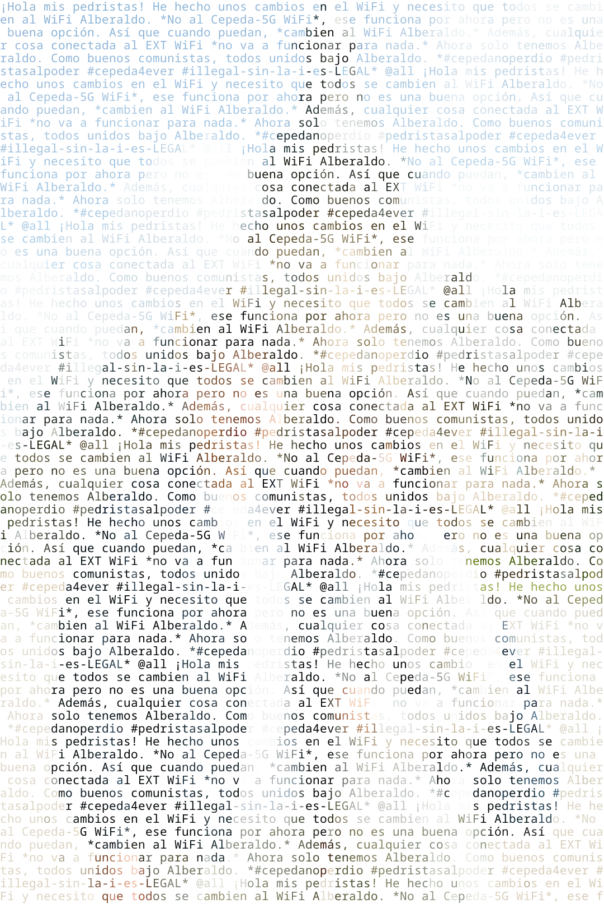

# image-play

`image-play` is a Go image effects toolkit.

The current CLI generates text mosaics: images recreated from repeated text, with each character colored from the source image. The effect writes to a transparent canvas, supports resizing and basic image adjustments, and accepts text from either a command-line flag or a text file.

---

## Example Output

<table>
  <tr>
    <th>Input Image</th>
    <th>Generated Text Mosaic</th>
  </tr>
  <tr>
    <td>
      
    </td>
    <td>
      
    </td>
  </tr>
</table>

Generated with:

```bash
./bin/mosaic \
  -in testdata/images/couple_tour.jpg \
  -font fonts/NotoSansMono-VariableFont_wdth,wght.ttf \
  -text-file testdata/text/sample_text_message.txt \
  -out results/ \
  -width 1080 \
  -v
```

---

## Features

- Generate text mosaic images from source images
- Draw output on a transparent canvas
- Sample source image colors per text character
- Resize output by target width
- Convert source image to black and white before sampling
- Adjust source image contrast before sampling
- Use inline text or a UTF-8 text file
- Resolve flexible output paths for files and directories
- Create missing output directories when enabled
- Preserve original image size when `-width` is `0`

---

## Project Structure

```txt
image-play/
├── cmd/
│   └── mosaic/
│       └── main.go
├── docs/
│   └── assets/
│       ├── input_img.jpg
│       └── generated_text_mosaic.png
├── fonts/
│   └── NotoSansMono-VariableFont_wdth,wght.ttf
├── internal/
│   ├── effects/
│   │   └── textmosaic/
│   │       ├── textmosaic.go
│   │       └── textmosaic_test.go
│   └── util/
│       ├── fileutils.go
│       └── fileutils_test.go
├── testdata/
│   ├── images/
│   │   └── couple_tour.jpg
│   └── text/
│       └── sample_text_message.txt
└── README.md
```

---

## Requirements

- Go 1.21+
- A monospace `.ttf` or `.otf` font
- An input image such as `.jpg` or `.png`

The repo includes a test font:

```txt
fonts/NotoSansMono-VariableFont_wdth,wght.ttf
```

---

## Build

From the repo root:

```bash
go build -o ./bin/mosaic ./cmd/mosaic
```

Show help:

```bash
./bin/mosaic -h
```

---

## CLI Usage

### Generate from a text file

```bash
./bin/mosaic \
  -in testdata/images/couple_tour.jpg \
  -font fonts/NotoSansMono-VariableFont_wdth,wght.ttf \
  -text-file testdata/text/sample_text_message.txt \
  -out output.png \
  -width 1080
```

### Generate from inline text

```bash
./bin/mosaic \
  -in testdata/images/couple_tour.jpg \
  -font fonts/NotoSansMono-VariableFont_wdth,wght.ttf \
  -text "Hello from the text mosaic generator. Привет мир." \
  -out inline-test.png \
  -width 1080
```

### Enable debug logging

```bash
./bin/mosaic \
  -in testdata/images/couple_tour.jpg \
  -font fonts/NotoSansMono-VariableFont_wdth,wght.ttf \
  -text-file testdata/text/sample_text_message.txt \
  -out output.png \
  -width 1080 \
  -v
```

---

## CLI Flags

```txt
-bw
      Convert source image to black and white before sampling

-contrast float
      Contrast adjustment percent.
      0 = no change
      20 = increase contrast by 20%

-create-dirs
      Create missing output directories
      Default: true

-font string
      Path to monospace TTF/OTF font
      Required

-font-size float
      Base font size before automatic scaling.
      0 = default

-in string
      Path to input image
      Required

-out string
      Output path. Can be a file or directory.
      Empty = input_mosaic.png

-overwrite
      Allow overwriting an existing output file
      Default: true

-text string
      Text to repeat across the mosaic

-text-file string
      Path to UTF-8 text file to use as mosaic text

-v
      Enable verbose/debug logging

-width int
      Target width in pixels.
      Common: 1080, 1920, 3840.
      0 = original size
```

---

## Output Path Behavior

The CLI supports flexible output paths.

Assuming the input image is:

```txt
couple_tour.jpg
```

### Explicit output file

```bash
-out output.png
```

Produces:

```txt
output.png
```

### Output filename without extension

```bash
-out result
```

Produces:

```txt
result.png
```

### Output directory with trailing slash

```bash
-out results/
```

Produces:

```txt
results/couple_tour_mosaic.png
```

### Existing output directory without trailing slash

```bash
-out existing-results
```

If `existing-results` already exists as a directory, produces:

```txt
existing-results/couple_tour_mosaic.png
```

### No output path

If `-out` is omitted, produces:

```txt
couple_tour_mosaic.png
```

---

# Effects

Each image effect should have its own section here.

---

## Text Mosaic

The text mosaic effect generates an image made entirely from repeated text.

The source image is used for color sampling, but the original image is not drawn directly into the output. The final output contains text pixels on a transparent background.

### How it works

1. Load the source image.
2. Optionally resize it.
3. Optionally adjust contrast.
4. Optionally convert it to grayscale.
5. Create a transparent output canvas.
6. Measure the selected monospace font.
7. Draw repeated text across a grid.
8. Sample the source image color at each grid point.
9. Draw each character using the sampled color.

### Text behavior

The text sequence advances only when a visible character is drawn. Transparent source pixels are skipped without consuming a character. This keeps the visible text more continuous and readable.

### Unicode support

The text mosaic effect indexes text using Go runes, not raw bytes.

Supported well:

- ASCII
- English
- accented Latin text
- Cyrillic
- Greek
- similar basic Unicode letters

Not currently supported:

- emoji
- complex grapheme clusters
- scripts requiring advanced shaping
- text where single-codepoint rendering is not enough

For best visual alignment, use a monospace font and text that renders consistently in that font.

### Examples

#### Standard 1080px output

```bash
./bin/mosaic \
  -in testdata/images/couple_tour.jpg \
  -font fonts/NotoSansMono-VariableFont_wdth,wght.ttf \
  -text-file testdata/text/sample_text_message.txt \
  -out output.png \
  -width 1080
```

#### Black-and-white output

```bash
./bin/mosaic \
  -in testdata/images/couple_tour.jpg \
  -font fonts/NotoSansMono-VariableFont_wdth,wght.ttf \
  -text-file testdata/text/sample_text_message.txt \
  -out bw-test.png \
  -width 1080 \
  -bw
```

#### Increased contrast

```bash
./bin/mosaic \
  -in testdata/images/couple_tour.jpg \
  -font fonts/NotoSansMono-VariableFont_wdth,wght.ttf \
  -text-file testdata/text/sample_text_message.txt \
  -out contrast-test.png \
  -width 1080 \
  -contrast 25
```

#### Custom base font size

```bash
./bin/mosaic \
  -in testdata/images/couple_tour.jpg \
  -font fonts/NotoSansMono-VariableFont_wdth,wght.ttf \
  -text-file testdata/text/sample_text_message.txt \
  -out font-size-test.png \
  -width 1080 \
  -font-size 10
```

#### 4K output

```bash
./bin/mosaic \
  -in testdata/images/couple_tour.jpg \
  -font fonts/NotoSansMono-VariableFont_wdth,wght.ttf \
  -text-file testdata/text/sample_text_message.txt \
  -out 4k-test.png \
  -width 3840
```

---

# Development

## Format

```bash
gofmt -w \
  internal/util/fileutils.go \
  internal/util/fileutils_test.go \
  internal/effects/textmosaic/textmosaic.go \
  internal/effects/textmosaic/textmosaic_test.go \
  cmd/mosaic/main.go
```

## Test

Run all tests:

```bash
go test ./...
```

Run verbose tests:

```bash
go test -v ./...
```

Run utility tests:

```bash
go test -v ./internal/util
```

Run text mosaic tests:

```bash
go test -v ./internal/effects/textmosaic
```

## Build

```bash
go build -o ./bin/mosaic ./cmd/mosaic
```

## Full local check

```bash
gofmt -w \
  internal/util/fileutils.go \
  internal/util/fileutils_test.go \
  internal/effects/textmosaic/textmosaic.go \
  internal/effects/textmosaic/textmosaic_test.go \
  cmd/mosaic/main.go && \
go test ./... && \
go build -o ./bin/mosaic ./cmd/mosaic && \
./bin/mosaic \
  -in testdata/images/couple_tour.jpg \
  -font fonts/NotoSansMono-VariableFont_wdth,wght.ttf \
  -text-file testdata/text/sample_text_message.txt \
  -out results/ \
  -width 1080 \
  -v
```

## Cleanup generated files

```bash
rm -rf \
  bin \
  output.png \
  result.png \
  couple_tour_mosaic.png \
  inline-test.png \
  bw-test.png \
  contrast-test.png \
  font-size-test.png \
  4k-test.png \
  go-run-test.png \
  results \
  existing-results
```

---

# Adding More Effects

When adding another effect:

1. Add the effect implementation under `internal/effects/<effect-name>/`.
2. Add tests next to the effect implementation.
3. Add CLI support under `cmd/` or a shared app layer.
4. Add a new section under `# Effects`.
5. Add one or two example commands.
6. Add documentation images under `docs/assets/` only when useful.

Suggested structure:

```txt
internal/
├── effects/
│   ├── textmosaic/
│   ├── blur/
│   ├── pixelate/
│   └── ...
├── util/
└── app/
```

---

# Design Notes

Effect packages should stay focused on image processing.

File paths, CLI flags, output naming, and filesystem behavior should stay outside effect packages. This keeps the core image effects easier to test and reuse.

Current separation:

- `cmd/mosaic` handles CLI input and orchestration.
- `internal/util` handles file path utilities.
- `internal/effects/textmosaic` handles text mosaic generation.

---

# License

MIT License. See [LICENSE](LICENSE).

Copyright (c) 2026 Santiago Gomez