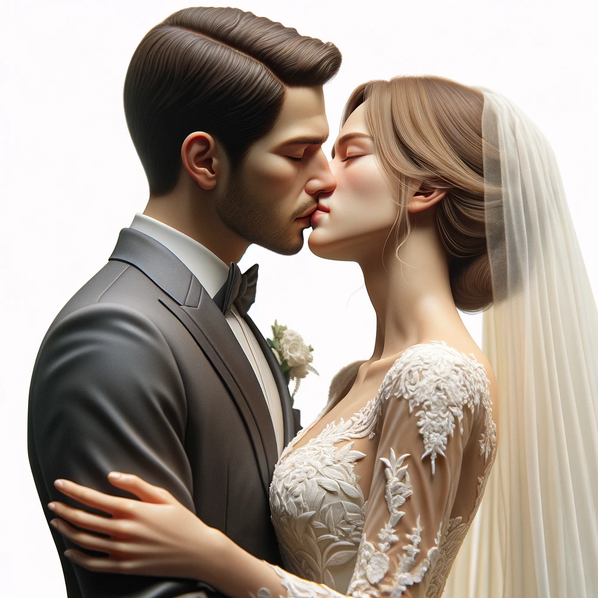
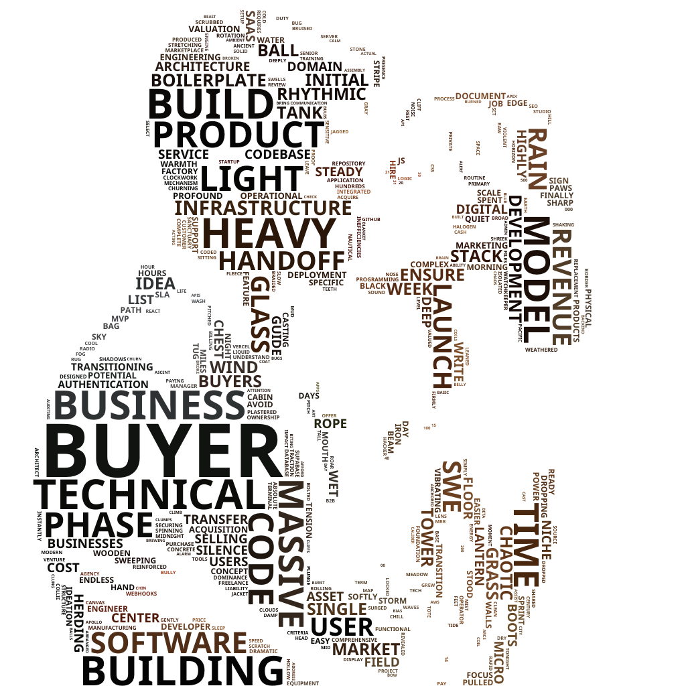
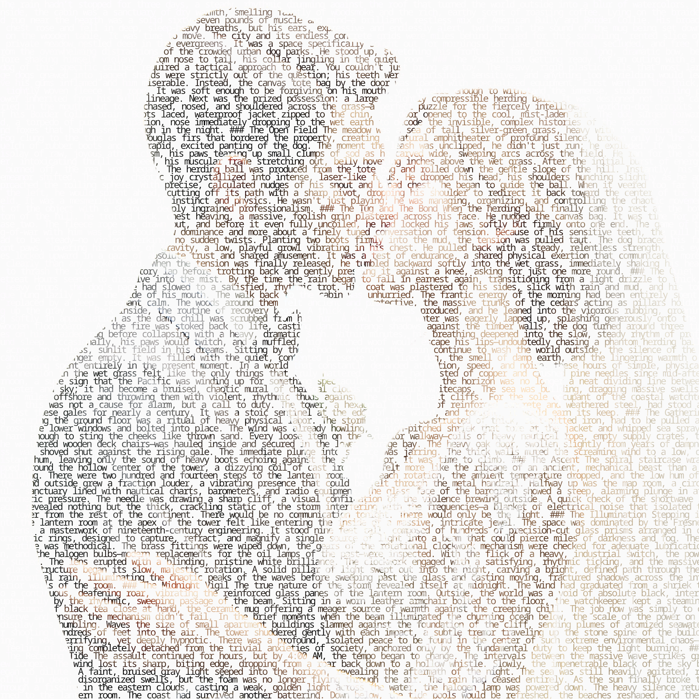
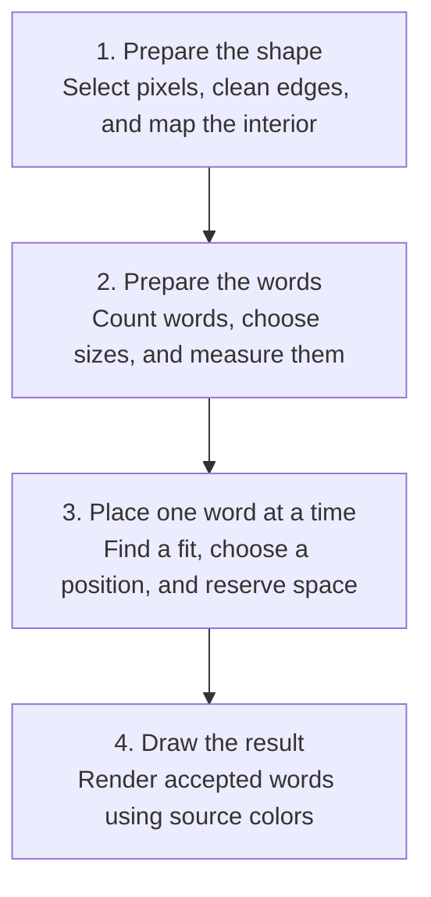
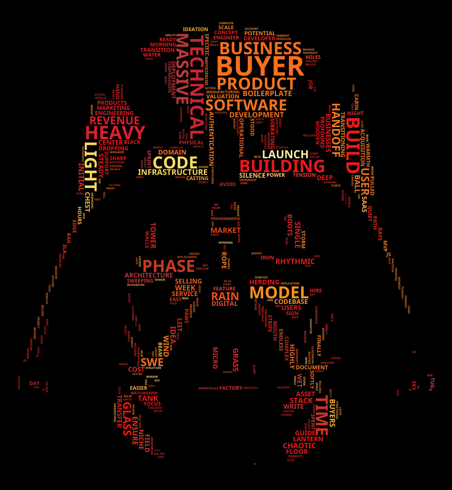
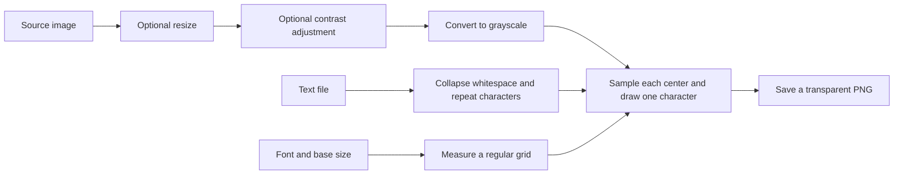

# How images become words

Imagine making a portrait in two ways. In one, you cut words out of paper and
arrange them inside the person's outline. In the other, you cover a page with
small letters, making each letter as light or dark as the photograph beneath it.

Those are the two effects in `image-play`:

- **Word cloud:** the image supplies a shape; the text supplies words and their
  relative importance.
- **Text mosaic:** the image supplies brightness; the text supplies a repeating
  stream of characters.

You do not need to know Go, image processing, or advanced mathematics to follow
this guide. Each section starts with an everyday explanation, then connects it
to the implementation. Equations are accompanied by worked examples.

This guide describes the current code. Small grids and invented numbers are
teaching examples, not measurements of the preview images. Research references
are identified where their ideas enter the explanation; links to our own code
show what this project actually implements.

## A route through the guide

1. [See the difference and try it](#1-see-the-difference-and-try-it).
2. [Learn the few image concepts we need](#2-the-few-image-concepts-we-need).
3. [Build a word cloud, step by step](#3-building-a-word-cloud).
4. [Build a text mosaic, step by step](#4-building-a-text-mosaic).
5. [Predict and adjust the results](#5-predicting-and-adjusting-the-results).
6. [Follow the code and check your understanding](#6-following-the-code).
7. [Find references and their role](#7-references-and-attribution).

## 1. See the difference and try it

<table>
  <tr>
    <th>Source image</th>
    <th>Word cloud</th>
    <th>Text mosaic</th>
  </tr>
  <tr>
    <td></td>
    <td></td>
    <td></td>
  </tr>
</table>

In the word cloud, look for words of different sizes and directions. In the
mosaic, look for rows of characters whose shades reveal the portrait. Zooming
out helps you see the image; zooming in helps you see the text.

| Question | Word cloud | Text mosaic |
| --- | --- | --- |
| What comes from the image? | A silhouette, interior distances, and local word colors | A brightness and transparency sample for each grid position |
| What comes from the text? | Distinct words and occurrence counts | Characters in their original order, with whitespace simplified |
| What changes between pieces of text? | Font size, position, orientation, and color | Drawing color and opacity; the font size stays fixed within one mosaic |
| What is the background? | Opaque black or white, inferred from the image border | Transparent between characters |
| What is preserved? | The selected shape and a visual ordering of words | An approximation of the image's light and dark structure |

Both commands need an image, a text file, and a font. From the repository root,
with Go and OpenCV set up as described in the [README](../README.md#development),
run:

```bash
go run ./cmd/mosaic \
  -effect wordcloud \
  -in testdata/images/gen-img-couple.png \
  -text testdata/text/sample_text_message.txt \
  -font fonts/NotoSans-Bold.ttf \
  -uppercase \
  -out wordcloud.png
```

For text mosaic, change the effect and output path, use
`-font "fonts/NotoSansMono-VariableFont_wdth,wght.ttf"`, and omit `-uppercase`.
The image and text paths stay the same. The quotation marks keep the mono font
path together as one command argument.

Open the mosaic over a dark background to see its light characters clearly.
Its PNG is transparent; the dark background in the preview above is for display.
If you omit `-out`, the program writes beside the input, for example
`gen-img-couple_wordcloud.png` or `gen-img-couple_textmosaic.png`.

## 2. The few image concepts we need

### Pixels, coordinates, and channels

A digital image is a rectangular grid of **pixels**, or picture elements.
A 1024 × 1024 image has 1024 columns and 1024 rows. A pixel's location is written
`(x, y)`: `x` increases to the right, and `y` increases downward. The top-left
pixel is `(0, 0)`.

A color pixel typically carries three **channels**, or stored values: red,
green, and blue, abbreviated RGB. In a common 8-bit representation each value
ranges from 0 to 255. `(0, 0, 0)` is black; `(255, 255, 255)` is white.

A fourth channel, **alpha**, says how opaque the pixel is. Alpha 0 is fully
transparent; alpha 255 is fully opaque. A transparent pixel can still contain
RGB values. Think of paint hidden behind a completely clear cutout: the stored
color exists, but it should not determine the visible shape.

### Grayscale and brightness

**Grayscale** replaces color with a light-to-dark value. We call that value
brightness or luminance in this guide. The conversion weights green more than
red, and red more than blue, rather than simply averaging the channels.

The mosaic's image library uses this formula, rounded to an 8-bit value:

```text
gray = 0.299 × red + 0.587 × green + 0.114 × blue
```

For an opaque pure-red pixel `(255, 0, 0)`, this gives about 76. A pure-green
pixel gives about 150. Equal channel values already describe a gray, so
`(100, 100, 100)` stays near 100. This is a practical weighted conversion of
stored color values, rather than a full physical model of light.
See [imaging's grayscale implementation](https://github.com/disintegration/imaging/blob/v1.6.2/adjust.go).

### Masks: a permission map

A **mask** is another grid with the same dimensions as the image. A **binary
mask** has only two states. Our word-cloud masks use 255 for allowed and 0 for
forbidden. Their white pixels mean “you may place something here,” even though
the final words use colors sampled from the original image.

```text
....###....
..#######..
.#########.
..#######..
....###....

# = allowed pixel     . = forbidden pixel
```

A **silhouette** is the selected shape represented by this map. It can have
holes, narrow passages, or several disconnected pieces. A mask answers where
something is permitted; it does not tell us whether a whole word fits.

### Fonts, glyphs, and measurement

A **font** supplies the shapes and spacing used to draw text. A **glyph** is a
drawn character shape. Font size is a scale parameter, not a guarantee that
every word will be that many pixels wide or tall.

At the same font size, `mountain` usually needs more width than `sky`. A
**monospace font** gives characters a consistent horizontal advance, like cells
in a typewriter. That makes it especially useful for the mosaic's regular grid.
A proportional font gives different advances to different characters.

The project uses `gg` to measure and draw text. Its measurements are layout
metrics, not a pixel-by-pixel outline of the ink. That distinction matters when
we explain rectangular word-cloud collision checks.
See [gg's text measurement and drawing source](https://github.com/fogleman/gg/blob/v1.3.0/context.go).

## 3. Building a word cloud

Picture putting labeled rectangular tiles inside a paper cutout. Larger tiles
are harder to place. Once a tile is placed, that space is no longer available.
The algorithm combines this packing problem with rules about visual importance.

Read this overview from top to bottom. Each arrow means “continue to the next
stage”; the prepared shape and words stay available throughout placement.



Stage 3 repeats for each candidate word. Reserving a rectangle leaves less free
space for the next word. If a word cannot fit even at the minimum size, skip it
and try the next candidate. After all candidates have been considered, stage 4
draws the accepted layout.

The numbered steps below unpack these four stages: steps 1–3 prepare the shape,
steps 4–6 prepare the words, steps 7–10 explain placement, and step 11 renders
the result.

### Step 1: Decide which pixels form the shape

The code keeps two versions of the image: the original colors for drawing,
and a grayscale copy for deciding where words may fit. For images with alpha,
pixels at or below the default alpha threshold of 8 are invisible. Hidden RGB
values must never create placement space.

**Thresholding** separates pixels into two brightness groups. **Otsu's method**
chooses the cutoff from the image's brightness distribution. It seeks groups
with small variation within each group; it does not identify objects.
See [OpenCV's thresholding tutorial](https://docs.opencv.org/4.x/d7/d4d/tutorial_py_thresholding.html).

The brightness distribution is a **histogram**: a count of pixels in each of
256 shade bins. A black background and an orange helmet tend to form two
brightness groups. Otsu helps separate those groups, but we still need to
choose which group should contain words.

Our rule is to treat the **image border as a clue about the background**.
We first select the dark group, then inspect visible pixels along the outer
perimeter. If more than half of those border pixels belong to the dark group,
we switch to selecting the bright group. Otherwise, we keep the dark group.
If visible luminance is uniform, or the entire border is transparent,
we keep dark-foreground selection as a fallback.

| Example | Border clue | Place words in | Draw on |
| --- | --- | --- | --- |
| Black logo on white | Light border | Dark logo pixels | White |
| Orange Vader helmet on black | Dark border | Bright helmet highlights | Black |
| Dark logo with a transparent border | No visible border clue | Dark visible pixels | White |

For Vader, selecting black pixels would fill the background and leave the
helmet as empty space. Selecting the bright group instead puts words into the
helmet's colored highlights. Its black eyes, vents, and surrounding background
remain empty. Those gaps help us recognize the helmet.

For a dark background, we also change the brightness measure to the strongest
RGB channel: `max(red, green, blue)`. A saturated red pixel such as
`(180, 0, 0)` has a low grayscale luminance, but its color intensity is 180.
This helps preserve red and blue detail beside bright yellow highlights. We
apply Otsu again to this intensity image. This is our design choice for colored
detail against darkness, rather than a claim about perceived brightness.

Before thresholding, invisible pixels are filled with the assumed background
brightness: initially white, and black if the border indicates a dark
background. The threshold is recomputed using color intensity after that switch.
This prevents hidden colors from forming a false brightness group; the number
of invisible pixels can still influence the histogram. Alpha is reapplied after cleanup as well.

This is a background heuristic, not object recognition. A tightly cropped subject
that fills the border, a busy background, or similar foreground and background
shades can confuse it. Inspect the debug mask to see the selected regions.

Code: [image loading and mask construction](../internal/imageutil/mask.go).

### Step 2: Clean the shape and leave an edge margin

Tiny specks and gaps make awkward packing spaces. **Morphology** edits a binary
shape using a small pattern called a **kernel** or **structuring element**.
**Erosion** keeps a pixel only when the kernel fits within the allowed shape;
**dilation** expands allowed regions. **Opening** is erosion followed by
dilation; **closing** reverses that order. Opening can remove small specks;
closing can fill small gaps. See [OpenCV's morphology tutorial](https://docs.opencv.org/4.x/d9/d61/tutorial_py_morphological_ops.html).

Our cleanup applies opening and closing with a 3 × 3 square. It then reapplies
the visibility mask: cleanup is allowed to connect nearby visible pixels, but
it must not turn transparent holes into placement space.

Placement adds a separate erosion, using `SafeZoneErodeSize`, which defaults to
3. On a straight interior boundary, a centered 3 × 3 kernel removes about one
pixel of allowed space at the edge. A 7 × 7 kernel removes about three. Narrow
parts can disappear entirely. Image-border behavior follows OpenCV's erosion
rules, so this is not a universal margin from the outer canvas edge.

Why use both cleanup and an edge margin? Cleanup repairs the shape; the safe
zone gives the layout breathing room around that repaired shape. These are
separate jobs.

Code: [mask cleanup](../internal/imageutil/mask.go) and
[safe-zone creation](../internal/effects/wordcloud/placement.go).

### Step 3: Understand where the shape is roomy

A **distance transform** gives each allowed pixel a distance to the nearest
background pixel. Think of a map where values rise as you walk farther into
the shape. Near an outline the value is small; deep in a broad part it is larger.
See [OpenCV's distance-transform explanation](https://docs.opencv.org/4.x/d2/dbd/tutorial_distance_transform.html).

The implementation requests an L2 distance transform from OpenCV and uses its
values to rank interior positions. The distance field comes from the cleaned
silhouette, before safe-zone erosion. The eventual legal positions must still
lie in the remaining safe space.

A deep point is an attractive candidate, but distance alone cannot prove a word
fits. A long rectangle might extend beyond a boundary even though its center
is well inside the shape. We need a test for the whole rectangle.

Code: [distance transform](../internal/imageutil/distance.go).

### Step 4: Turn the text into words and counts

The word cloud breaks text into **tokens**, lowercases them, removes known
**stop words**, and counts what remains. A token here is a consecutive run of
Unicode letters or numbers. Punctuation separates tokens.

For example:

```text
Input:      Mountains, mountains! Rivers? Mountains; rivers; clouds.
Tokens:     mountains mountains rivers mountains rivers clouds
Counts:     mountains → 3, rivers → 2, clouds → 1
```

Common connecting words such as `the` and `and` are filtered using the bundled
stop-word map. That map merges the language lists in the repository's JSON;
the algorithm does not detect a language and select only its list. This can
remove a token because it is a stop word in another language.

The tokenizer does not infer meaning. It does not combine synonyms, turn plurals
into singulars, or preserve punctuation within a word. `garden` and `gardens`
remain distinct; `sun-lit` becomes two tokens. Unicode letters and numbers are
supported, but combining marks are separators under this tokenizer, and text
without separating punctuation or spaces may form a single token. A suitable
font is still needed to draw the resulting text.

The top 500 distinct candidates are considered by default. This limit describes
the pool to try, rather than a promise of 500 words in the final image.

Code: [counting](../internal/textutil/countwords.go),
[frequency ordering](../internal/textutil/wordcounts.go), and
[stop-word generation](../internal/textutil/cmd/genstopwords/main.go).

### Step 5: Let the shape help choose the font-size range

A large image can contain a narrow subject. Choosing the maximum font size from
canvas dimensions alone would overlook that distinction. Instead, we run a
small **probe**, or trial layout, using the real shape, font, and important words.

The trial starts with the larger of the image height and the minimum font size.
It tries candidates in frequency order until two words have been placed or the
candidate pool is exhausted. The second successful word starts no larger than
the first successful word's actual size. Trial reservations are thrown away;
the real layout starts with fresh space.

When two successes have sizes `a` and `b`, the maximum is their **harmonic mean**,
rounded to a whole pixel and kept at least as large as the minimum:

```text
maximum = 2 × a × b / (a + b)

For a = 100 and b = 50:
maximum ≈ 67 px
```

The ordinary average would be 75. The harmonic mean gives the smaller success
more influence, making the starting scale less dominated by one easy-to-fit
word. With one success, we use its rounded size; with none, we fall back to the
minimum. Final generation still fails if no words can be placed.

This calibration strategy draws on Andreas Mueller's `word_cloud`, which also
probes top words and combines two resulting sizes with a harmonic mean.
Our surrounding placement and sizing rules differ.
See [the upstream implementation](https://github.com/amueller/word_cloud/blob/main/wordcloud/wordcloud.py).

The default minimum is **6 px for every image**. A positive `MinFontSize`
overrides it. Large source dimensions do not automatically raise this floor.

Code: [font-range calibration](../internal/effects/wordcloud/sizing.go).

### Step 6: Translate frequency into a target size

A count of 100 should look more prominent than a count of 10, but making its
font ten times larger would let it overwhelm the cloud. We compress counts
logarithmically, then use the square root of that fraction to give intermediate
counts more of the available size range.

Here is a worked example with counts 1, 10, and 100, a minimum of 6 px, and a
maximum of 60 px. These values illustrate sizing, before any packing changes.

| Count | Linear target size | Our target size, approximately |
| ---: | ---: | ---: |
| 1 | 6 px | 6 px |
| 10 | 11 px | 42 px |
| 100 | 60 px | 60 px |

The middle word remains smaller than the most frequent word. For readers who
want to calculate it, the implementation uses `log(1 + count)`:

```text
fraction = [ln(1 + count) − ln(1 + smallestCount)]
           / [ln(1 + largestCount) − ln(1 + smallestCount)]

targetSize = minimumSize + √fraction × (maximumSize − minimumSize)
```

`ln` is the natural logarithm. You can understand the behavior without knowing
how to calculate it: equal multiplication of counts produces more similar
steps than equal addition does. The smallest and largest counts are taken
from the selected candidate pool. If all counts are equal, every word starts
at the maximum; there is no frequency difference to encode.

Font size also differs from ink area: scaling both dimensions by two can make
area grow by roughly four. The picture therefore communicates relative
prominence, not an exact chart of counts.

Words are measured using the actual font. Frequency sets their primary order.
For equal frequencies, larger measured rectangle areas go first, then
alphabetical order breaks remaining ties. This gives harder-to-fit words a
chance before smaller words fragment the available space.

Code: [logarithmic scaling](../internal/mathutil/scale.go) and
[word sizing and measurement](../internal/textutil/words.go).

### Step 7: Give each word a padded rectangular footprint

A **footprint** is the rectangle reserved for a word, including padding. If a
word measures 20 pixels wide and 10 high, with 1 pixel of padding on each side,
its horizontal footprint is 22 × 12. At 90 degrees it becomes 12 × 22.

```text
footprintWidth  = ceil(measuredWidth  + 2 × padding)
footprintHeight = ceil(measuredHeight + 2 × padding)
```

`ceil` means round upward. Footprint dimensions are kept at least 1 pixel.
Allowed rotations are 0 and 90 degrees. These preserve axis-aligned rectangles,
which makes complete collision checks straightforward.

Padding keeps words apart. It is different from safe-zone erosion: padding
belongs to each word; erosion belongs to the silhouette.

Rectangles simplify collision checks and make the geometry independently
verifiable. They also reserve space around and between letters. A gap in an
`o`, or space above a short glyph, is not available to another word. This is a
tradeoff between reliable, understandable geometry and tighter packing.

### Step 8: Find every legal center

The **free-space mask** starts as the safe zone. Each reservation removes a
rectangle from it. For each orientation, we ask where the whole footprint fits
inside the remaining allowed pixels.

We answer with erosion again, this time using a kernel the size of the word's
footprint. The output is a map of **legal centers**. Its nonzero pixels are all
integer positions whose rectangles fit.

Consider this simple free space and a 3 × 3 footprint:

```text
Free space:          Legal centers:
.......              .......
.#####.              .......
.#####.              ..CCC..
.#####.              .......
.......              .......

# = free             C = a center where all 9 footprint pixels fit
```

There are three legal centers. A center one row higher would put the rectangle
outside the free shape. A single occupied pixel under any part of the footprint
would disqualify that center too.

This is a complete search over the integer grid for that rectangle. We do not
walk a spiral and hope to encounter a good point. Pixels outside the image are
explicitly forbidden during this fit calculation. An oversized footprint has
no legal centers.

Even-sized rectangles need a consistent anchoring convention. The code uses:

```text
left = centerX − floor(width / 2)
top  = centerY − floor(height / 2)
```

It owns `width` columns starting at `left` and `height` rows starting at `top`.
The erosion anchor and reservation use the same convention. Matching those two
operations prevents one-pixel disagreements about what a center represents.

**“Exact fit” refers to these measured, padded rectangles on the integer grid.**
It does not mean exact glyph outlines, perfect image segmentation, or a globally
optimal arrangement. Existing tests compare the center maps against checking
every rectangle pixel directly on small irregular shapes.

Code: [free-space geometry](../internal/layout/free_space.go) and
[exhaustive comparison tests](../internal/layout/free_space_test.go).

### Step 9: Choose the largest fitting whole-pixel size

Placement first tries the desired size, capped by the previous successful
word's actual size. Minimum sizes round upward; desired sizes round downward.
For example, a minimum of 6.2 means at least 7 px, and a target of 29.8 starts
at 29 px.

If the desired size fails, the algorithm checks the minimum in every configured
orientation over all free space. If the minimum also fails, it skips that word
and continues with the next candidate. A long word can fail while a short word
still fits.

If the minimum fits, a **binary search** finds the largest fitting integer size.
It checks the middle of the remaining size range, then discards the half that
cannot contain the answer. Suppose 6 fits, 30 fails, and 18 is the largest fit:

```text
Try 18: fits       → search 18…29
Try 24: fails      → search 18…23
Try 21: fails      → search 18…20
Try 19: fails      → only 18 remains
```

This relies on the footprint model becoming no larger as the font size shrinks.
Words are remeasured at each trial size. Trial fit checks do not reserve space;
only the final accepted placement does.

The cap from the previous success keeps actual font sizes non-increasing. If
an important word shrinks to 18 px, a later word cannot grow back to 30 px.
Frequency therefore influences the result, but shape constraints can flatten
its intended size differences.

Code: [placement and size search](../internal/effects/wordcloud/placement.go).

### Step 10: Choose a balanced position and reserve it

Many centers may fit equally well geometrically. We need a visual policy to
choose among them. Always choosing near one central point can leave distant
parts of the silhouette underused.

The project selects deep, separated points as **seeds**. Labels spread outward
from those seeds through neighboring allowed pixels, like several colors of
ink spreading across a paper cutout. This is a **multi-source flood fill**.
Eight neighbors are considered, including diagonals. Up to 24 initial seeds
are selected; any unassigned disconnected components receive additional seeds,
so 24 is not a strict limit on the final region count.

Each labeled **region** tracks its total area and how much has been reserved.
Among regions containing legal centers, we prefer the lowest occupied fraction:

```text
Region A: 20 occupied pixels / 100 total = 20%
Region B: 30 occupied pixels / 300 total = 10%

Prefer B, although it has more occupied pixels in absolute terms.
```

Equal fractions favor the larger region. Within the selected region, we prefer
the first configured orientation with a legal center, then its deepest legal
center. Default orientation order is horizontal, then vertical. A less-filled
region with only vertical positions can therefore win over another region with
horizontal positions.

A word may cross region boundaries. Regions rank its center; they are not walls
around its rectangle. Reservation credits the pixels actually occupied in each
region it crosses. Geometry still checks the full rectangle against free space.

This policy draws on ShapeWordle's use of a distance field and multiple shape
parts. ShapeWordle develops shape-aware spiral trajectories; this implementation
uses erosion to enumerate legal centers, followed by its own region-ranking
policy. It is an adaptation of those guiding ideas, rather than a reproduction
of the paper's full algorithm.
See [Wang and colleagues' ShapeWordle publication](https://www.microsoft.com/en-us/research/publication/shapewordle-tailoring-wordles-using-shape-aware-archimedean-spirals/).

Once chosen, the footprint is removed from free space, region usage is updated,
and the occupancy diagnostic is marked. Earlier words are not rearranged.
This makes the layout **greedy**: it commits to one good local choice at a time.
A different arrangement might fit more words overall; exhaustive center checks
for one word do not solve the entire packing problem optimally.

Code: [region construction and ranking](../internal/effects/wordcloud/regions.go).

### Step 11: Draw the accepted layout

The placement result records each word, actual font size, center, and angle.
The renderer starts with an opaque black canvas when the mask selected bright
foreground, and an opaque white canvas otherwise. Unoccupied space therefore
matches the background's brightness group.

Each accepted word gets **one color from the original image**. The renderer
groups the source colors under its measured rectangle and selects an actual
pixel color near the center of the largest color group. Transparent pixels
contribute nothing; partially transparent pixels contribute according to their
alpha. For a vertical word, the rectangle's width and height swap before
sampling. A word spanning red and yellow therefore stays a source color
instead of becoming an artificial orange blend. The sampled color is then
moved farther from the canvas color for readability. Dark colors get brighter
against black, and light colors get darker against white. A color identical to
the canvas has no direction to move without inventing a new color.

Finally, the renderer loads the font at the accepted size, moves the drawing
origin to the word's center, rotates it, and draws the colored text with a
centered anchor. It restores the drawing state for the next word. Keeping
sampling and drawing separate from packing makes geometry easier to inspect.

Try the dark-background fixture:

```bash
go run ./cmd/mosaic \
  -effect wordcloud \
  -in testdata/images/darth_vader_og.jpg \
  -text testdata/text/sample_text_message.txt \
  -font fonts/NotoSans-Bold.ttf \
  -uppercase \
  -out vader-colored.png
```



The result should contain red, orange, and yellow words on black. It will not
reproduce every painted detail: thresholding discards dark shading, and whole
word rectangles need more room than individual image pixels.

Code: [word-cloud orchestration](../internal/effects/wordcloud/wordcloud.go) and
[renderer](../internal/effects/wordcloud/render.go).

## 4. Building a text mosaic

Imagine placing a sheet of evenly spaced letters over a photograph. At each
letter's position, pick up the photograph's shade and use it to draw the letter.
Viewed from a distance, those shades suggest the original picture.

There is no word counting or rectangle packing in this effect. Its geometry
is a regular grid.



### Step 1: Prepare the photograph

`TargetWidth` optionally resizes the source, keeping its aspect ratio. For
example, a 1200 × 800 image resized to width 600 becomes 600 × 400. Zero keeps
the original dimensions. Resizing uses the imaging library's **Lanczos** filter:
it combines nearby source samples to construct the resized image, rather than
merely selecting every other pixel.
See [imaging's resize implementation](https://github.com/disintegration/imaging/blob/v1.6.2/resize.go).

`ContrastPercent` optionally changes the separation between light and dark
values before grayscale conversion. Positive values increase contrast; negative
values pull shades toward the middle. Zero leaves contrast unchanged. Strong
positive adjustments can lose subtle shading by pushing values to black or
white. This is a tonal adjustment, not a sharpening operation.
See [imaging's contrast implementation](https://github.com/disintegration/imaging/blob/v1.6.2/adjust.go).

Finally, grayscale conversion makes the red, green, and blue values equal.
The mosaic therefore reproduces brightness rather than source hues.

Code: [source preparation](../internal/effects/textmosaic/image.go).

### Step 2: Make a repeating character stream

Whitespace is simplified, while case and punctuation are retained. For example:

```text
Input:       " Hello\n\nworld!\tCafé "
Normalized:  "Hello world! Café "
Repeated:    "Hello world! Café Hello world! Café ..."
```

A trailing space separates the end of one repetition from the next. The code
uses Go **runes**, which represent Unicode code points, rather than stepping
through individual UTF-8 bytes. This keeps a character such as `é` from being
split into bytes. A rune is not necessarily a complete user-perceived symbol:
combining accents and some emoji use several code points. Font coverage and
text shaping still affect how those appear.

Spaces occupy grid positions even though they draw no ink. No stop-word
filtering occurs, because the text is a drawing material rather than a list
of topics to rank.

Code: [text loading and normalization](../internal/effects/textmosaic/text.go).

### Step 3: Measure the grid

The default base font size is 14. The implementation multiplies it by a factor
chosen from the processed image width. These are established visual-density
settings, not a mathematical rule that every image effect must use.

| Processed image width | Multiplier | Actual size with base 14 |
| --- | ---: | ---: |
| Up to 720 px | 0.75 | 10.5 |
| 721–1079 px | 1.0 | 14 |
| 1080–2159 px | 1.5 | 21 |
| 2160–3599 px | 2.0 | 28 |
| 3600–4799 px | 3.5 | 49 |
| 4800–7199 px | 4.0 | 56 |
| 7200 px and above | 4.5 | 63 |

The font is loaded at that actual size. The width of `MMMMMMMMMM` is measured
and divided by ten to estimate one cell's width. Cell height is measured text
height times 1.4, leaving vertical spacing. Both values round upward and are
at least 1 pixel.

For an illustrative measurement of 8 pixels per character and 14 pixels in
height, the cell becomes 8 × 20: `ceil(14 × 1.4) = 20`. A 160 × 100 canvas then
has 20 columns and 5 rows of centers. The first center is half a cell from the
top and left, using integer division; subsequent centers are one cell apart.
Partial edge cells can occur when dimensions are not exact multiples.

A monospace font keeps the grid visually regular. A proportional font can be
loaded, but measuring `M` does not make other glyphs equally wide. A font whose
cell is larger than the image produces an error.

### Step 4: Sample a shade and draw a character

The renderer walks rows from top to bottom, and each row from left to right.
At each center it samples the processed source image and draws the next rune
with that sampled color and alpha. When the text ends, it wraps to the beginning.

For opaque pixels, the rule is easy to picture:

| Sample at a grid center | Character drawn there |
| --- | --- |
| Dark gray, value 30 | Dark-gray character |
| Mid gray, value 128 | Mid-gray character |
| Light gray, value 230 | Light-gray character |
| Fully transparent | Nothing; the text index does not advance |

The font size and grid spacing remain fixed across that image. Brightness does
not choose a denser character such as `@` or a lighter one such as `.`. The next
character comes from your text; its drawing shade comes from the photograph.
This distinguishes the effect from ASCII-art algorithms that choose symbols
according to their ink density.

Sampling uses one pixel at the center, not an average of every pixel in the
cell. A small feature between centers can therefore be missed. Different
glyphs also have different amounts of ink, so this is an artistic approximation
of the image rather than a pixel-perfect brightness reconstruction.

### Step 5: Understand the transparent result

The output starts as a transparent canvas. Only drawn glyphs contribute visible
pixels; spaces and gaps remain transparent. Glyph edges use partial coverage
(**antialiasing**) to look smoother on the pixel grid.

On a black background, light glyphs stand out and dark glyphs blend into the
background. On white, the same light glyphs can be difficult to see. Background
choice changes the impression because much of the final image is still empty.
The renderer does not paint the original photograph underneath the text.

A detail for developers: `sampleRGBA` divides Go's `Color.RGBA()` channels by
65535 to obtain values from 0 to 1. Go returns RGB values already multiplied by
alpha, and this renderer passes those values along with alpha to `gg.SetRGBA`.
It does not undo that multiplication. Partially transparent samples therefore
should not be interpreted as a simple copy of the original unmultiplied color.
Opaque samples follow the shade examples above.
See [Go's Color contract](https://pkg.go.dev/image/color#Color).

Code: [grid measurement, sampling, and drawing](../internal/effects/textmosaic/render.go)
and [file-to-PNG pipeline](../internal/effects/textmosaic/textmosaic.go).

## 5. Predicting and adjusting the results

### Change one input and predict what happens

Try these small experiments using the existing CLI commands:

1. **Repeat one content word several times in the text.** The cloud's counts and
   target sizes change; its layout can change too. The mosaic repeats a different
   character stream but still samples shades from the same image.
2. **Use a wider font.** Cloud footprints get wider, so words may shrink, rotate,
   or be skipped. Mosaic cell measurements change, affecting the grid density.
3. **Use a silhouette with a thin neck and broad body.** Large cloud words fit
   more readily in the body. A tiny word might fit the neck after larger words
   fail there. The mosaic samples both areas wherever its grid centers land.
4. **View the mosaic on black and white backgrounds.** Its pixels have not
   changed, but the contrast against the transparent gaps has.

Before each run, predict the result in a sentence. Afterward, zoom in to inspect
the letters and zoom out to judge the shape. This connects the mechanism to
what you actually see.

### Settings you can change in Go

The CLI currently exposes only `-effect`, `-in`, `-text`, `-font`, and `-out`.
The controls below are Go configuration fields, not additional command-line
flags. Start with `NewConfig` so defaults are populated, then use options or
assign fields before calling `Generate`.

| Word-cloud setting | Default | What a change means |
| --- | --- | --- |
| `MinFontSize` | 0, resolved to 6 px | Raising it makes the smallest text larger but can skip more words |
| `WordLimit` | 500 | More distinct candidates to attempt; available space still limits success |
| `SafeZoneErodeSize` | 3 | A larger positive odd kernel shrinks the permitted shape more |
| `WordPadding` | 1 px per side | More separation, larger footprints, and less room for words |
| `AlphaThreshold` | 8 | Raising it excludes more low-opacity source pixels |
| `Angles` | `[0, 90]` | Allowed orientations in preference order; only these two angles are supported |
| `Debug` | `false` | Write intermediate images to explain the layout |

For a complete example, save the following as `learn.go` at the repository root
and run `go run learn.go` from there. It creates a horizontal-only cloud with
a 10 px minimum and writes its diagnostic images:

```go
package main

import (
	"log"

	"github.com/santiagoa58/image-play/internal/effects/wordcloud"
)

func main() {
	cfg := wordcloud.NewConfig(
		wordcloud.WithInputPath("testdata/images/gen-img-couple.png"),
		wordcloud.WithTextPath("testdata/text/sample_text_message.txt"),
		wordcloud.WithFontPath("fonts/NotoSans-Bold.ttf"),
		wordcloud.WithUppercase(true),
		wordcloud.WithOutputPath("cloud.png"),
		wordcloud.WithMinFontSize(10),
		wordcloud.WithDebug(true),
	)
	cfg.Angles = []int{0} // Permit horizontal words only.
	if err := wordcloud.Generate(cfg); err != nil {
		log.Fatal(err)
	}
}
```

`NewConfig` starts with defaults, the `With...` options override selected values,
and `Generate` runs the pipeline. Go's `internal` packages are intended for use
within this repository's module tree, which is why the example lives here.
This small program is an alternative entry point for experimenting; the normal
CLI remains `go run ./cmd/mosaic`.

| Text-mosaic setting | Default | What a change means |
| --- | --- | --- |
| `TargetWidth` | 0, keep source width | Resize before measuring and sampling; preserve aspect ratio |
| `BaseFontSize` | 14 | Larger values mean larger cells and usually less image detail |
| `ContrastPercent` | 0 | From −100 to 100; increase or decrease tonal separation |

To try the mosaic controls, replace the contents of `learn.go` with this example
and run the same command. It resizes to 600 px wide, uses base size 12, and adds
15 percent contrast:

```go
package main

import (
	"log"

	"github.com/santiagoa58/image-play/internal/effects/textmosaic"
)

func main() {
	cfg := textmosaic.NewConfig(
		textmosaic.WithInputPath("testdata/images/gen-img-couple.png"),
		textmosaic.WithTextPath("testdata/text/sample_text_message.txt"),
		textmosaic.WithFontPath("fonts/NotoSansMono-VariableFont_wdth,wght.ttf"),
		textmosaic.WithOutputPath("mosaic.png"),
		textmosaic.WithTargetWidth(600),
		textmosaic.WithBaseFontSize(12),
		textmosaic.WithContrastPercent(15),
	)
	if err := textmosaic.Generate(cfg); err != nil {
		log.Fatal(err)
	}
}
```

At width 600, base size 12 becomes an actual font size of 9 after the 0.75
multiplier. Change one option at a time to see its effect. You can remove the
temporary `learn.go` when finished experimenting.

See [word-cloud configuration](../internal/effects/wordcloud/config.go) and
[mosaic configuration](../internal/effects/textmosaic/config.go).

Changing mosaic width can also cross a font-size multiplier boundary. Doubling
width does not always double the number of characters across the image.
Reducing font size adds samples and detail, but eventually the letters become
hard to read. A cloud's fixed 6 px floor has the same readability tradeoff when
a large output is displayed as a small preview.

### Read the cloud's intermediate images in order

With `Debug` enabled and output `cloud.png`, the program also writes:

| File | How to read it |
| --- | --- |
| `cloud_01-mask.png` | White is the selected silhouette. If this shape is wrong, later packing cannot repair it. |
| `cloud_02-distance.png` | Brighter values indicate deeper interior locations; values are normalized for display. |
| `cloud_03-regions.png` | Different gray labels show different regions. Their brightness does not represent importance. |
| `cloud_04-safe-zone.png` | White is the shape remaining after the placement edge erosion. |
| `cloud_05-occupancy.png` | White shows reserved rectangles, including padding and empty spaces around glyphs. |
| `cloud_06-wordcloud.png` | A diagnostic copy of the rendered cloud. |

There is no per-word legal-center debug image in the current writer. The
legal-center maps are computed internally and released after use.

If the cloud looks sparse, first inspect the selected shape and safe zone, then
compare occupancy with the final letters. Space may exist visually between
letters but already belong to a rectangle. Large minimum size, generous padding,
narrow regions, and greedy earlier placements can each reduce the final count.

If a mosaic loses a small feature, compare its size with the cell spacing. If it
looks blank, check the viewing background and the source's transparency. If it
fails with a font-size error, reduce the base size or use a larger image.

## 6. Following the code

The program divides work by responsibility. A **pipeline** is simply a sequence
where each stage turns one useful representation into the next.

| Responsibility | Start reading here |
| --- | --- |
| Parse arguments and select an effect | [`cmd/mosaic/main.go`](../cmd/mosaic/main.go) |
| Coordinate the word-cloud stages | [`wordcloud.go`](../internal/effects/wordcloud/wordcloud.go) |
| Select the silhouette | [`mask.go`](../internal/imageutil/mask.go) |
| Rank words and measure them | [`countwords.go`](../internal/textutil/countwords.go), [`words.go`](../internal/textutil/words.go) |
| Calibrate the maximum size | [`sizing.go`](../internal/effects/wordcloud/sizing.go) |
| Search sizes and commit placements | [`placement.go`](../internal/effects/wordcloud/placement.go) |
| Prove rectangular fit and reserve pixels | [`free_space.go`](../internal/layout/free_space.go) |
| Choose among valid positions | [`regions.go`](../internal/effects/wordcloud/regions.go) |
| Draw the accepted cloud | [`render.go`](../internal/effects/wordcloud/render.go) |
| Coordinate the mosaic stages | [`textmosaic.go`](../internal/effects/textmosaic/textmosaic.go) |
| Prepare mosaic source and text | [`image.go`](../internal/effects/textmosaic/image.go), [`text.go`](../internal/effects/textmosaic/text.go) |
| Measure, sample, and draw the mosaic | [`render.go`](../internal/effects/textmosaic/render.go) |

For the cloud, read `Place` as a short workflow: try the desired size, find a
smaller fitting word if necessary, and place it. Follow `largestFittingFontSize`
for the search, `choosePlacementCenter` for the choice, and `reserveFootprint`
for the state update. Geometry answers “can this rectangle fit?” Region policy
answers “which valid position should we prefer?” Keeping these questions
separate makes both reasoning and verification easier.

An OpenCV **Mat** is a matrix object holding image data, with native resources
that must be released. A placement context owns its free-space and diagnostic
masks. Temporary center maps are closed after their results have been used.
Go's `defer` schedules cleanup for when a function returns, including error
returns. Resource ownership matters even though the visible task is artistic.

The existing tests check several kinds of behavior: transparent pixels stay
excluded from cloud masks; rectangle centers match exhaustive checks; rotations
and padding affect fit; placement finds the largest fitting size; region
accounting follows actual reserved pixels; and mosaics handle whitespace,
transparency, dimensions, and output files. These are checks of particular
mechanisms, not a guarantee that every input yields an attractive picture.

For past visual and timing comparisons, see the
[word-cloud baseline](wordcloud-baseline.md). Its original measurements include
an older spiral-search implementation and later replacements; read the stage
labels before comparing results. Single-run times are not universal speed
promises.

### Explain it back to yourself

Try answering these before reading the answers:

1. Why can a word fail even when its center is inside the silhouette?
2. Why does a count of 100 not imply ten times the font size of a count of 10?
3. Can a word cross the boundary between two shape regions?
4. Why can a skipped long word be followed by a successful short word?
5. Does the mosaic choose `@` for dark pixels and `.` for light pixels?
6. Why can the same transparent mosaic look different on two backgrounds?

**Answers:** A whole padded rectangle must fit, not just its center. Logarithmic
scaling compresses count differences, and packing can shrink words further.
Regions rank centers and track usage; they do not confine footprints. Shorter
words need differently shaped rectangles and can fit remaining gaps. Mosaic
characters come from the text in order; sampled pixels set their color. The
viewing background shows through the transparent gaps.

A useful explanation to give someone else is: “The cloud counts words and packs
padded word rectangles into a selected shape, coloring them from the image.
The mosaic repeats characters
on a grid and colors each one using the image beneath its center.” You can now
expand either sentence into the steps and tradeoffs behind it.

## 7. References and attribution

The implementation links throughout this guide are the source of truth for
project-specific behavior. These external references explain underlying
operations or identify documented design influences:

1. **OpenCV, [Image Thresholding](https://docs.opencv.org/4.x/d7/d4d/tutorial_py_thresholding.html).**
   Reference for binary thresholding and Otsu's method, used in silhouette selection.
2. **OpenCV, [Morphological Transformations](https://docs.opencv.org/4.x/d9/d61/tutorial_py_morphological_ops.html).**
   Reference for erosion, dilation, opening, and closing. Our kernel choices and
   legal-center/reservation convention are specified by this repository.
3. **OpenCV, [Image Segmentation with Distance Transform and Watershed Algorithm](https://docs.opencv.org/4.x/d2/dbd/tutorial_distance_transform.html).**
   Reference for the meaning of a distance transform. We use a distance field;
   we do not implement the tutorial's watershed pipeline.
4. **Yunhai Wang et al., [ShapeWordle: Tailoring Wordles using Shape-aware Archimedean Spirals](https://www.microsoft.com/en-us/research/publication/shapewordle-tailoring-wordles-using-shape-aware-archimedean-spirals/),
   IEEE Transactions on Visualization and Computer Graphics, 2020.** Documented
   influence for distance-guided, multi-part shape placement. Our complete
   rectangular center search and occupancy ranking are different mechanisms.
5. **Andreas Mueller and contributors, [`word_cloud` source](https://github.com/amueller/word_cloud/blob/main/wordcloud/wordcloud.py),
   `generate_from_frequencies`.** Documented influence for calibrating the font
   range by probing important words and taking a harmonic mean. It is not the
   source of our full packing algorithm. The linked `main` branch can evolve.
6. **disintegration/imaging, v1.6.2, [adjustment source](https://github.com/disintegration/imaging/blob/v1.6.2/adjust.go)
   and [resize source](https://github.com/disintegration/imaging/blob/v1.6.2/resize.go).**
   Actual dependency used for mosaic grayscale, contrast adjustment, and resizing.
7. **Michael Fogleman, `gg`, v1.3.0, [context source](https://github.com/fogleman/gg/blob/v1.3.0/context.go).**
   Actual drawing dependency used for font measurement, anchored text, and rendering.
8. **Go standard library, [`image/color.Color`](https://pkg.go.dev/image/color#Color).**
   Contract for the alpha-premultiplied values returned by `RGBA()`.

The checked-in [stop-word data](../internal/textutil/data/stopwords.json) and
[generator](../internal/textutil/cmd/genstopwords/main.go) explain the current
filter. They do not record an upstream dataset attribution; this guide does not
assign one without evidence. Any recovered upstream provenance and applicable
license should be recorded alongside that data.

External references were checked while writing this guide. OpenCV's `4.x` URLs
follow its current documentation; the linked library sources are pinned where
the repository pins a dependency. For supported versions and build requirements,
consult [go.mod](../go.mod), the [Dockerfile](../Dockerfile), and the
[README](../README.md#development).
