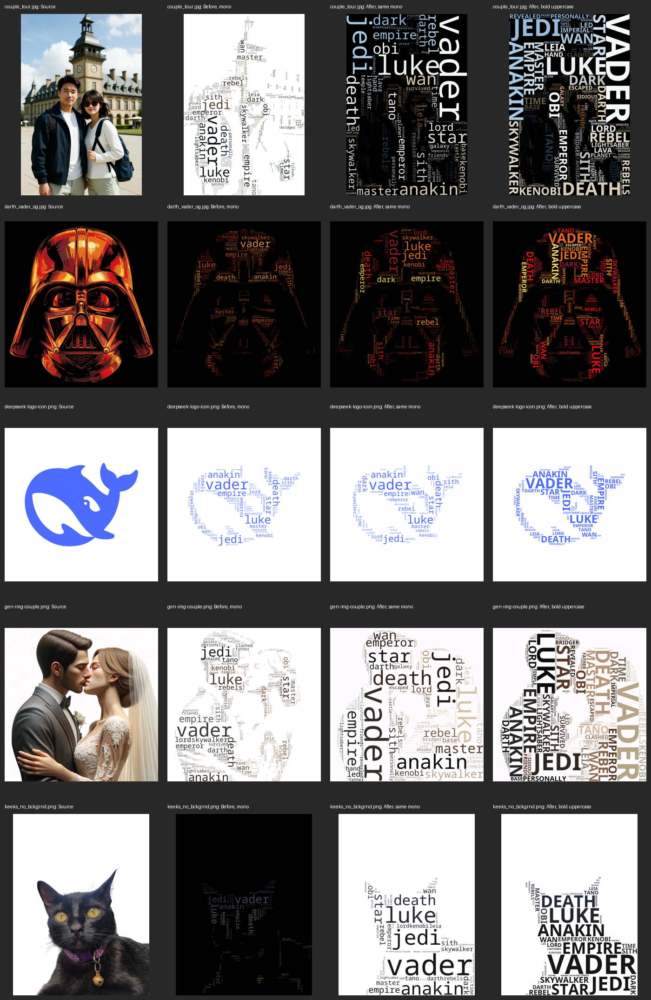

# Word-cloud quality comparison

These results compare the previous word-cloud implementation (`a8f344c`) with
separate subject geometry and contrast, independent per-word size search,
actual ink-bound measurement, and colors sampled under the letters.

Every run used all five images, `testdata/text/darth_vader.txt`, and the default
500-candidate limit. The text produces 459 distinct candidates after filtering.
The regular runs use the same `NotoSansMono-VariableFont_wdth,wght.ttf` as the
original commands. The style comparison uses `NotoSans-Bold.ttf` and
`-uppercase`. All runs used Go 1.27.1 and OpenCV 4.10 in the same local container.



The columns are source, previous mono, revised mono, and revised bold uppercase.
Transparent originals are shown on white for this comparison.

| Image | Automatic selection | Words before | Words after, mono | Words after, bold uppercase | Visible text before | Visible text after, mono | Visible text after, bold |
| --- | --- | ---: | ---: | ---: | ---: | ---: | ---: |
| `couple_tour.jpg` | scene | 370 | 330 | 371 | 10.5% | 22.6% | 39.7% |
| `darth_vader_og.jpg` | border | 421 | 407 | 439 | 6.7% | 8.8% | 14.1% |
| `deepseek-logo-icon.png` | border | 79 | 67 | 69 | 5.5% | 5.0% | 7.9% |
| `gen-img-couple.png` | border | 459 | 240 | 268 | 11.3% | 18.3% | 32.7% |
| `keeks_no_bckgrnd.png` | alpha | 81 | 60 | 48 | 3.5% | 9.9% | 16.6% |

“Visible text” is the percentage of the entire output whose maximum RGB-channel
difference from the solid canvas exceeds 12. It measures visible ink, not
reserved rectangles, subject recognition, or reading comfort. Every full-pool
regular and bold output had **zero visible text pixels outside its subject map**
under that same contrast criterion. Counts and coverage are observations from
these runs, not universal targets.

The results show several different tradeoffs:

- **Vader:** border-connected removal retains darker red paint without turning
  the black exterior into word space. Representative colors preserve source
  reds and yellows rather than averaging them together. Bold lettering gives
  stronger coverage, but thin contours remain difficult for rectangular packing.
- **DeepSeek:** transparent rounded corners surround an opaque white panel.
  The panel is removed, leaving the blue whale as word space. The original font
  has slightly less visible coverage than before; the bold option has more.
- **Cat:** alpha supplies the complete cutout geometry, and dark fur gets a
  white canvas. Larger readable words can reduce the count while increasing
  visible text. Small features such as eye colors can still be lost when a
  whole word receives one representative color.
- **Portrait on white:** subject geometry is retained independently of light
  clothing and darker shading. Independent font-size searches permit larger
  later words, which changes the frequency hierarchy's visual balance and
  reduces the number of tiny words that can fit.
- **Couple Tour:** the busy border selects the **whole-scene fallback**. This is
  a deliberate behavior change: it preserves scene colors rather than claiming
  to identify the people. Use a matching white-subject/black-background mask
  with `-mask` when the people alone are the intended subject.

A denser output is not automatically a more recognizable image. Large words,
one color per word, and rectangular occupancy still limit detailed image
reconstruction. This iteration does not introduce letter-shaped collision
checks, repeated words, or a second gap-filling pass.

## Reproduce the comparison

With the normal Go/OpenCV development environment, run from the repository root:

```bash
scripts/test-wordcloud-images.sh testdata/out
scripts/test-wordcloud-images.sh testdata/out/bold -uppercase -font fonts/NotoSans-Bold.ttf
scripts/test-wordcloud-images.sh testdata/out/mean -color-mode mean
```

The script generates `vader.png`, `couple_tour.png`, `deepseek_logo.png`,
`gen-img-couple.png`, and `keeks_no_bckgrnd.png`, matching the three original
output names. The first argument selects the output directory; remaining
arguments are passed to the CLI. Add `-debug` to write geometry, contrast,
placement, and rendering diagnostics alongside each output.

`go test ./...` includes synthetic regressions for shaded geometry, alpha,
opaque panels with transparent frames, explicit mask dimensions, independent
word sizes, representative colors, rotated glyph sampling, and hidden RGB.
It also generates all five fixtures with both fonts/styles, using 60 candidates
per run for the integration tests, and verifies dimensions and visible subject
containment. The full-pool CLI runs above complement those tests.

Font provenance and licensing are recorded in [fonts/README.md](../fonts/README.md).
The [teaching guide](how-the-effects-work.md) explains the algorithms, examples,
settings, and external references.
